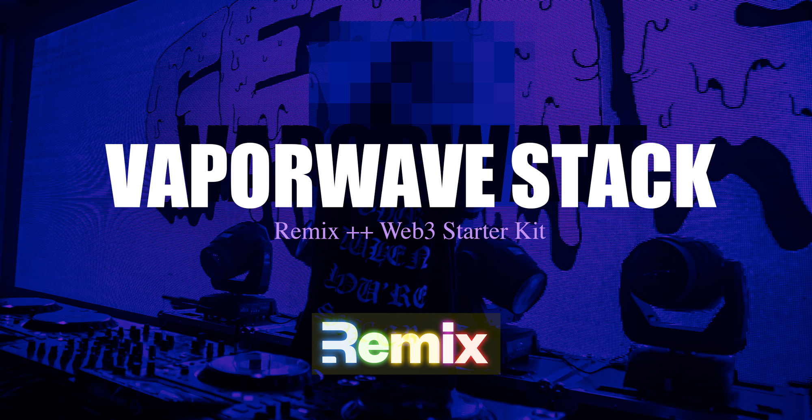

# WIP



# Remix >> Vapor Wave Stack

```bash
npx create-remix@latest --template startupdotdev/vapor-wave-stack
```

Please remove tailwind from CDN before production! [Check here](https://tailwindcss.com/docs/installation) for how to install tailwind correctly, or feel free to remove and install your CSS solution of choice.

Opinionated examples of:

- tools for interacting with Ethereum (ethers.js, web3modal, more)

- methods for sharing web3 state with your application (providers, transactions, updates) => hooks

- organization for interacting with contracts

- as essentialist collection of components (e.g. wallet-connect)

All code is authored to be easy to follow, not perfectly abstracted. This allows folks that use this library to feel the weight and motion of how the underlying technology functions.

## App Lifecycle

Before connection
Connecting
After connection
Errors

## `DappContext`

## `DappData`

## `DC/<Components>`

### `DC/connect-wallet`

## Interacting with Ethereum

- Local RPC (w/hardhat)
- Metamask
- External RPCs

# Remix Docs

- [Remix Docs](https://remix.run/docs)

## Development

From your terminal:

```sh
npm run dev
```

This starts your app in development mode, rebuilding assets on file changes.

## Deployment

First, build your app for production:

```sh
npm run build
```

Then run the app in production mode:

```sh
npm start
```

Now you'll need to pick a host to deploy it to.

### DIY

If you're familiar with deploying node applications, the built-in Remix app server is production-ready.

Make sure to deploy the output of `remix build`

- `build/`
- `public/build/`

### Using a Template

When you ran `npx create-remix@latest` there were a few choices for hosting. You can run that again to create a new project, then copy over your `app/` folder to the new project that's pre-configured for your target server.

```sh
cd ..
# create a new project, and pick a pre-configured host
npx create-remix@latest
cd my-new-remix-app
# remove the new project's app (not the old one!)
rm -rf app
# copy your app over
cp -R ../my-old-remix-app/app app
```

---

## TODO: Questions to answer && document

- Signer vs Provider

> A Provider is an abstraction of a connection to the Ethereum network, providing a concise, consistent interface to standard Ethereum node functionality. [https://docs.ethers.io/v5/api/providers/](https://docs.ethers.io/v5/api/providers/)

Web3 providers are responsible for querying blockchain nodes [ref](https://blog.quicknode.com/the-importance-of-web3-provider-redundancy/). Use multiple providers for additional redundancy.

Most common client-side provider libraries support connecting to multiple back-end providers for redundancy.

In `ethers.js` a signer is an abstraction of an Ethereum account. An common example of this would a wallet, which is able to execute operations. In `web3.js` it may be thought of as an [account](https://docs.ethers.io/v5/migration/web3/#migration-from-web3-js--signers--creating-signer) that can be used for signing more than a `signer`.

When authoring Dapps, providers and signers are some of your most fundamental primitives.

- `window.ethereum`

`window.ethereum` is browser global abstraction [provided by Metamask](https://docs.metamask.io/guide/ethereum-provider.html) that [may be used](https://www.tabnine.com/code/javascript/functions/builtins/Window/ethereum) as a provider.

This is build based on [eip-1193](https://eips.ethereum.org/EIPS/eip-1193).

- What is an account? Multiple accounts?

Accounts are wallets with accessible private keys able to sign? There are many accounts that may be available to the provider? See [accountsChanged](https://eips.ethereum.org/EIPS/eip-1193#accountschanged)

- What is an RPC Node

See free RPC nodes [here](https://ethereumnodes.com/)

- What is ethers.js or web3.js?

Both are a collection of utilities to interact with wEb3. [web3.js](https://web3js.readthedocs.io/en/v1.7.4/#web3-js-ethereum-javascript-api) / [https://docs.ethers.io/v5/](https://docs.ethers.io/v5/)

- What is a _node_?

JSONRpc

- What is a Dapp?

- Dapp optimization

Cache data that you need often that doesn't change often (e.g. ERC20 token meta data).

#### Open questions

Does ethers contain a stateful representation of each new provider you connect to?

Does [Web3Modal](https://github.com/Web3Modal/web3modal) facilitate providers or signers?

Example of localnode && metamask at the same time? (maybe helpful https://docs.ethers.io/v5/migration/web3/#migration-from-web3-js--providers--connecting-to-ethereum)

#### Random code references

- https://github.com/kigorw/eth-utils/blob/main/eth.ts
- https://github.com/kigorw/eth-utils/blob/main/eth.ts#L180 `subscribe to receipts`
- https://github.com/kigorw/eth-utils/blob/main/eth.ts#L205 `subscribe to pending`
